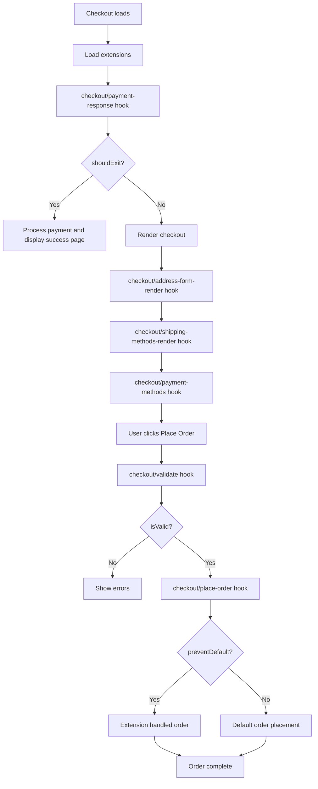

# Commerce Checkout Extensions

This directory contains extensions for the commerce-checkout block. Extensions allow you to customize checkout behavior without modifying the base block files.

The extension manager itself is provided by the SDK (`@dropins/tools/lib.js`). The block passes the extensions registered here to `createExtensionManager`, which handles hook execution and external resource loading.

## Overview

The extension system runs all hooks sequentially. Hooks let you:

- Handle payment provider redirects
- Add custom payment methods
- Add custom validation logic
- Handle order placement
- Customize address form rendering
- Customize shipping method rendering



## Quick Start

### Enable an Extension

1. Import your extension in `index.js`
2. Add it to the default export array

```javascript
import myExtension from './my-extension/my-extension.js';

export default [
  myExtension,
];
```

### Disable an Extension

Comment it out in `index.js`:

```javascript
export default [
  // myExtension,  // Disabled
];
```

## Extension Structure

```javascript
export default {
  id: 'unique-extension-id',
  name: 'My Extension',
  
  externalScripts: [
    'https://example.com/sdk.js',
  ],
  externalStyles: [
    'https://example.com/styles.css',
  ],
  
  hooks: {
    'checkout/payment-methods': async ({ context }) => {
      context.paymentMethods['my-payment'] = {
        render: (ctx) => {
          // Render your payment UI
        },
      };
    },
    
    'checkout/validate': async ({ context }) => {
      if (context.code !== 'my-payment') return;
      if (!await myCustomValidation()) context.isValid = false;
    },
    
    'checkout/place-order': async ({ context }) => {
      const { cartId, code } = context;
      
      if (code !== 'my-payment') return;
      
      context.preventDefault = true;
      
      await processPayment();
      await orderApi.placeOrder(cartId);
    },
  },
};
```

## Hook Pattern

Every hook receives `{ context }`:

- **`context`** - Shared object you can read from and write to
- All hooks run sequentially for each extension
- Use early `return` to skip your logic if not applicable

## Available Hooks

### `checkout/payment-methods`

Add payment methods by writing to `context.paymentMethods`.

**Context:** `{ paymentMethods }`

- `paymentMethods` - Object to add your payment methods to

**Example:**

```javascript
'checkout/payment-methods': async ({ context }) => {
  context.paymentMethods['my-payment'] = {
    autoSync: false,
    render: (ctx) => {
      const container = document.createElement('div');
      ctx.replaceHTML(container);
    },
  };
}
```

---

### `checkout/validate`

Add custom validation logic before order placement. Default form validation runs first - this hook only runs if default validation passes.

**Context:** `{ code, isValid }`

- `code` - The selected payment method code
- `isValid` - Set to `false` to fail validation

**Pattern:**

- If it's not your payment method → early `return`
- If it's your payment method → run validation, set `isValid = false` if failed

**Example:**

```javascript
'checkout/validate': async ({ context }) => {
  const { code } = context;
  
  if (code !== 'my-payment') return;
  
  const customCheck = await myCustomValidation();
  if (!customCheck) {
    context.isValid = false;
  }
}
```

---

### `checkout/place-order`

Handle custom payment method order placement.

**Context:** `{ cartId, code, preventDefault }`

- `preventDefault` - Set to `true` to skip the default order placement

**Pattern:**

- If it's not your payment method → early `return`
- If it's yours → process payment, place order, set `context.preventDefault = true`

**Example:**

```javascript
'checkout/place-order': async ({ context }) => {
  const { cartId, code } = context;
  
  if (code !== 'my-payment') return;
  
  context.preventDefault = true;
  
  await processPayment();
  await orderApi.placeOrder(cartId);
}
```

---

### `checkout/payment-response`

Handle payment responses from external payment providers (e.g., PayPal, Klarna, iDEAL). Runs at the very start of checkout before any initialization.

**Context:** `{ block, shouldExit }`

- `block` - The checkout block element to render into
- `shouldExit` - Set to `true` to skip normal checkout initialization (e.g., after showing order confirmation)

**Pattern:**

- Check URL params and session storage for pending payment data
- If pending payment detected → process response, render result, set `shouldExit = true` on success
- On error → clear block, set up error handler, leave `shouldExit = false` to continue with checkout

**Example:**

```javascript
'checkout/payment-response': async ({ context }) => {
  const urlParams = new URLSearchParams(window.location.search);
  const redirectResult = urlParams.get('redirectResult');
  
  if (!redirectResult || !hasPendingPaymentData()) return;
  
  const success = await completePayment(context.block, redirectResult);
  context.shouldExit = success;
}
```

---

### `checkout/address-form-render`

Control rendering of address forms (shipping/billing). Extensions can wrap the `render` function to augment behavior before/after rendering.

**Context:** `{ container, addressType, formProps, render, getFormContainer, hasCartAddress, addressDataKey }`

- `container` - DOM element where the form should be rendered
- `addressType` - Either `'shipping'` or `'billing'`
- `formProps` - Default props passed to the AddressForm container
- `render` - Async function to render the address form. **Extensions can wrap this function** to add behavior before/after rendering. Accepts an optional props object passed to the `AddressForm` container
- `getFormContainer` - Function that returns the form container instance (use `.setProps()` to update form values after render)
- `hasCartAddress` - Whether the cart already has an address of this type
- `addressDataKey` - Session storage key for address data

**Pattern (Wrapper):**

Extensions wrap `context.render` to control the rendering flow:

```javascript
'checkout/address-form-render': async ({ context }) => {
  const { addressType, hasCartAddress } = context;

  if (addressType !== 'shipping' || hasCartAddress) return;

  // 1. Capture original render
  const originalRender = context.render;

  // 2. Replace with wrapped version
  context.render = async (props) => {
    // A. Call original render (form appears in DOM)
    const result = await originalRender(props);

    // B. Now manipulate the rendered form
    // ... your customizations ...

    return result;
  };
}
```

---

### `checkout/shipping-methods-render`

Control rendering of shipping methods. Extensions can wrap the `render` function to augment behavior before/after rendering.

**Context:** `{ container, render }`

- `container` - DOM element where shipping methods will be rendered
- `render` - Async function to render shipping methods. **Extensions can wrap this function** to add behavior before/after rendering. Accepts an optional props object passed to the `ShippingMethods` container

**Slot context for `ShippingMethodItem`:**

When the `ShippingMethodItem` slot callback is invoked, it receives a context object (`ctx`) with:

- `method` - The `ShippingMethod` object (includes `value`, `title`, `amount`, `carrier`, etc.)
- `isSelected` - Whether this method is currently selected
- `onSelect()` - Call to select this shipping method
- `replaceWith(element)` - Replace the default item with your custom element
- `onRender(callback)` - Register a callback invoked on re-renders (e.g., when selection changes). Receives the updated context

**Pattern (Wrapper):**

Extensions wrap `context.render` to control the rendering flow:

```javascript
'checkout/shipping-methods-render': async ({ context }) => {
  const originalRender = context.render;

  context.render = async (props) => {
    // A. Call original render (shipping methods appear in DOM)
    const result = await originalRender(props);

    // B. Now manipulate the rendered shipping methods
    // ... your customizations ...

    return result;
  };
}
```

**Example:**

```javascript
'checkout/shipping-methods-render': async ({ context }) => {
  const originalRender = context.render;

  context.render = (props) => originalRender({
    ...props,
    slots: {
      ...props?.slots,
      ShippingMethodItem: (ctx) => {
        const card = document.createElement('label');
        card.className = 'my-shipping-card';
        card.innerHTML = `
          <input type="radio" name="shipping-method" value="${ctx.method.value}"
            ${ctx.isSelected ? 'checked' : ''} />
          <span>${ctx.method.carrier.title} — ${ctx.method.title}</span>
          <span>$${ctx.method.amount.value.toFixed(2)}</span>
        `;

        ctx.replaceWith(card);

        card.querySelector('input').addEventListener('change', () => {
          ctx.onSelect();
        });

        ctx.onRender(({ isSelected }) => {
          card.classList.toggle('my-shipping-card--selected', isSelected);
          card.querySelector('input').checked = isSelected;
        });
      },
    },
  });
}
```

---

## Creating a New Payment Method Extension

Here's a complete example for an external payment method:

```javascript
import * as checkoutApi from '@dropins/storefront-checkout/api.js';
import * as orderApi from '@dropins/storefront-order/api.js';

let paymentInstance = null;

export default {
  id: 'my-payment',
  name: 'My Payment Gateway',
  
  externalScripts: [
    'https://cdn.mypayment.com/sdk.js',
  ],
  externalStyles: [
    'https://cdn.mypayment.com/sdk.css',
  ],
  
  hooks: {
    // Handles payment response and sets context.shouldExit
    'checkout/payment-response': async ({ context }) => {
      const redirectResult = new URLSearchParams(window.location.search).get('result');
      if (!redirectResult) return;
      
      // Do not render the checkout and handle the payment response (e.g., render the checkout success page)
      context.shouldExit = true;
    },

    'checkout/payment-methods': async ({ context }) => {
      context.paymentMethods['my_payment'] = {
        autoSync: false,
        render: async (ctx) => {
          const container = document.createElement('div');
          
          paymentInstance = await window.MyPayment.create({
            apiKey: 'your-api-key',
            container,
          });
          
          ctx.replaceHTML(container);
        },
      };
    },

    'checkout/validate': async ({ context }) => {
      if (context.code !== 'my_payment') return;
      
      if (!paymentInstance?.isValid()) {
        context.isValid = false;
      }
    },

    'checkout/place-order': async ({ context }) => {
      const { cartId, code } = context;
      
      if (code !== 'my_payment') return;
      
      context.preventDefault = true;

      const token = await paymentInstance.getToken();
      
      await checkoutApi.setPaymentMethod({
        code: 'my_payment',
        my_payment: { token },
      });

      await orderApi.placeOrder(cartId);
    },
  },
};
```

Then enable it in `index.js`:

```javascript
import myPaymentExtension from './my-payment/my-payment-extension.js';

export default [
  myPaymentExtension,
];
```

## Best Practices

1. **Use module-level variables for state** - Simple and scoped to your extension
2. **Use early returns** - Skip your logic with `return` if not applicable
3. **Signal via context mutation** - Use `context.isValid = false` for validation hooks
4. **Use meaningful extension names** - Make them unique and descriptive
5. **Handle errors gracefully** - Use try/catch and log errors
6. **Test with multiple extensions** - Ensure your extension composes properly

## Support

For issues or questions about the extension system, please refer to the main documentation.
